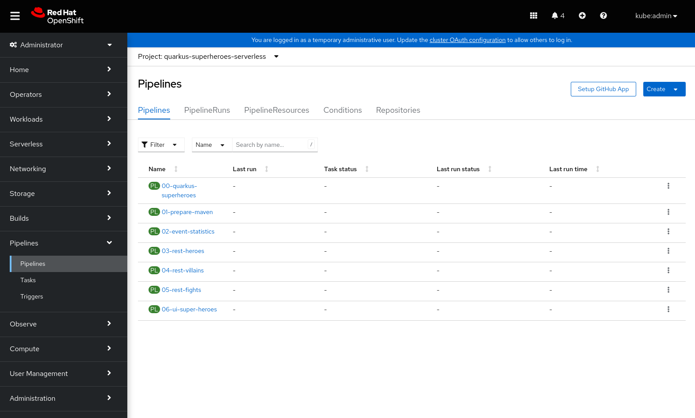

# Openshift Appdev All in One Demo!

The purpose of this repository is to provide you with a simple method to deploy and demo multiple components within the Red Hat Openshift Application development environment. Many of the components is integrated with each other tries to illustrate the full flow of components and how you might want to use them within a production environment.

Currently a shell script exists to prepare Openshift Local / Cloud Ready Containers. This will be expanded to work on Openshift Container Platform / Single Node Openshift.

## What can we Demo Today

1. Openshift GitOps - by setting up the demo environment
2. Openshift Pipelines - Build our serverless applications
3. Openshift Pipelines with GitOps - Deploy our serverless application with the pipeline syncing the GitOps application
4. Openshift Serverless (Knative Serving)
5. Openshift Service Mesh
6. ODF LVM - This serves as our backing store for ODF Multi Cloud Gateway (Noobaah) etc.

## What will come in future  

1. A/B Deployments ( Other deployment models )
2. 3Scale API Management
3. Openshift Serverless (Knative Eventing)
4. Openshift Serverless (Functions)
5. Openshift Serverless with Integration (Camel-K)
6. User namespace monitoring
7. KEDA - Event based autoscaling

# Configuration & Requirements

This demo requires a minimum of 32GB RAM to run.

A Minimum CPU requirement of 4 Cores with Hyperthreading / 8vCPU. 8 cores with hyperthreading/ 16vCPU is recommended.

# Deployment

- [README Single Node Openshift](README-SNO.md)
- [README Openshift Local](README-CRC.md)

## Ansible Playbooks

  The setup of the demo environment is done via ansible playbooks.

  I have written custom libraries that monitor the state of things such as syncing ArgoCD/GitOps applications, syncing custom resources, monitoring operator installs etc. This ensures certain steps in the ansible roles only run when the dependencies they have are ready to be consumed. As an example the Service Mesh Operator requires ElasticSearch and Kiali Operators to be deployed before the service mesh can be created.

## Openshift GitOps/ArgoCD

  The initial script will deploy the GitOps operator and when ready deploys the cluster configs application. 

  Other GitOps applications will be deployed via the ansible playbooks. These applications include deploying operators, ODF LVM, Pipelines, Service mesh etc.

  Most of the applications will automatically sync to keep they're state intact. Others will not such as the quarkus-superheroes application. These will be synced by other means such as pipelines.

  The credentials for the the admin user in gitops will be extracted and printed by the ansible-playbook as the last step for usage. Alternatively this secret can be extracted manually from the Openshift UI.

  

## Openshift Pipelines/Tekton

  At this we use the quarkus superheroes github repository that can be found here: https://github.com/quarkusio/quarkus-super-heroes.git

  The quarkus super heroes API features multiple microservices low resource requirements, thanks to Quarkus. Due to the microservices having interservices dependencies using REST they form an ideal candidate for Service Mesh coming later.

  There is also a stage within the pipeline that triggers the sync of the quarkus demo application knative deployment. This bothnot only shows how GitOps can sync resources but also how these resources could be synced after a successfull pipeline run.

  

## 4. Openshift Serverless

  We use quarkus native built applications. We use this for the startup times required for Openshfit Serverless. Since we are using a mesh of microservices the minimum count has been set to 0 container. The reason for this is that it takes a few seconds for everything downstream to start up.

  On the event statistics endpoint we will set the minimum to 1 so that we can show it starting a new instance up as needed. The purpose is to show it handling a each new request with a new pod instance.

  Note: You have to access both the rest-fights and the ui-superheroes external links directly once when using self service mesh signed certificates (The default for this demo). HTTPs is a requirement for using Serverless on Service mesh. If don't access the rest-fights service the and accept the self signed certificate then the UI will not work correctly as it calls that service.

  https://docs.openshift.com/container-platform/4.10/serverless/admin_guide/serverless-ossm-setup.html

  

  When using self-signed certificates (default) you will need to access the rest-fights and ui-super-heroes URL's to accept the certificates. The reason for this is that ui-super-heroes does calls to the rest-fights service. If the certificate is not trusted the browser then you will not get a valid response from the UI.

## 5. Openshift Service Mesh

  Openshift Service mesh was set up so that we can monitor the state of our quarkus microservices. Two of the rest services are exposed externally while the rest are internal to the cluster.

  

## 6. Quarkus Super Heroes

When you access the Quarkus Superheroes UI service you will be presented with an an application where you compare/fight superheroes and villains.

This is infact a set of microservices that form a mesh:

## 6. Openshift Service Mesh - Kiali Dashboard

We can view traffic flow from the Kiali Dashboard. The link can be found in the istio-system namespace. This is part of the Service Mesh deployment.

You will need to select the quarkus-superheroes-serverless namespace freom the graph menu. If you don't see the namespace there, restart the kiali operator in the openshift-operators namespace.

